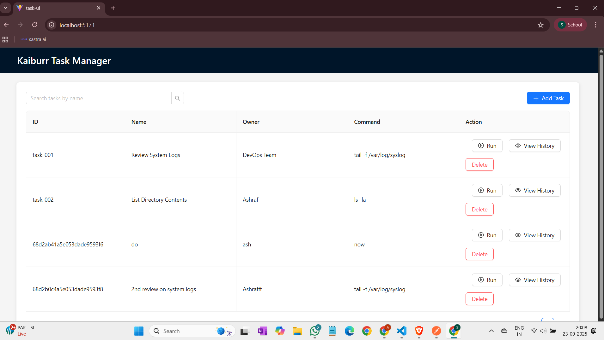
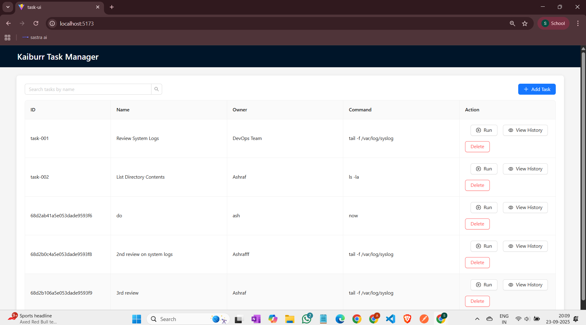
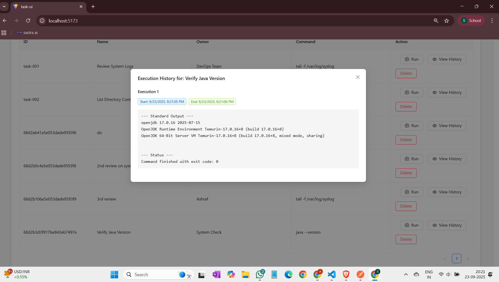
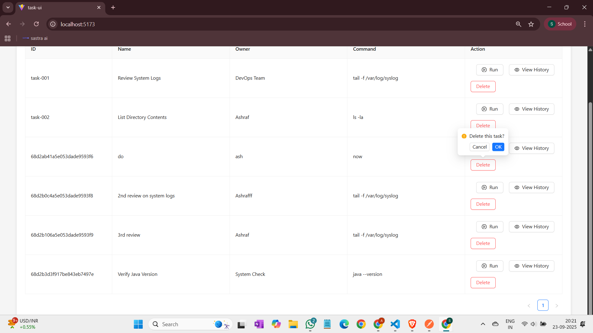

# Kaiburr Technical Assessment - Task 3: React Web UI

This repository contains the solution for **Task 3**, a feature-rich frontend application built to interact with the Java backend API from Task 1.

The UI is built using **React 19**, **TypeScript**, and the **Ant Design** component library, with a strong focus on usability, accessibility, and a professional user experience. It provides a full-featured dashboard to manage and execute remote commands.

---

## 🚀 Features Implemented

- **Task Dashboard:** Displays all tasks in a clean, paginated, and bordered table.
- **Create Tasks:** A user-friendly modal form with real-time input validation for adding new tasks.
- **Delete Tasks:** A safe delete operation with a confirmation pop-up to prevent accidental data loss.
- **Live Search:** A search bar to dynamically filter tasks by name, providing immediate results.
- **Command Execution:** A "Run" button for each task to trigger the backend execution endpoint, with clear loading and success/error feedback notifications.
- **View Execution History:** A dedicated modal to view the complete, timestamped output of all previous command executions for a specific task, including formatted error messages.
- **Responsive Feedback:** The UI provides constant feedback for all user actions, including loading spinners, success/error messages (`antd message`), and clear error alerts for API failures.

---

## 🛠️ Technology Stack

- **Framework:** React 19 (bootstrapped with Vite)
- **Language:** TypeScript
- **UI Component Library:** Ant Design
- **API Client:** Axios for asynchronous HTTP requests
- **Package Manager:** npm

---

## 📋 Prerequisites

- **Node.js and npm** installed.
- The **Java Backend API (from Task 1)** must be running on `http://localhost:8090`.

---

## ⚙️ How to Run Locally

1.  **Clone the repository:**

    ```bash
    git clone https://github.com/Ashraf0705/kaiburr-task3-react-ui.git
    cd kaiburr-task3-react-ui
    ```

2.  **Install dependencies:**

    ```bash
    npm install
    ```

3.  **Start the development server:**

    ```bash
    npm run dev
    ```

The application will be available at `http://localhost:5173`.

---

## 📸 Application Screenshots

### 1. Main Dashboard View
*The main view showing the task list, search bar, and action buttons for each task.*

<p align="center">
  
</p>

---

### 2. Adding a New Task
*The modal form for creating a new task with input validation.*

<p align="center">
  
</p>

---

### 3. Viewing Command Execution History
*The modal displaying the timestamped output from a successfully run command.*

<p align="center">
  
</p>

---

### 4. Deleting a Task
*The confirmation pop-up ensures safe deletion of tasks.*

<p align="center">
  
</p>
